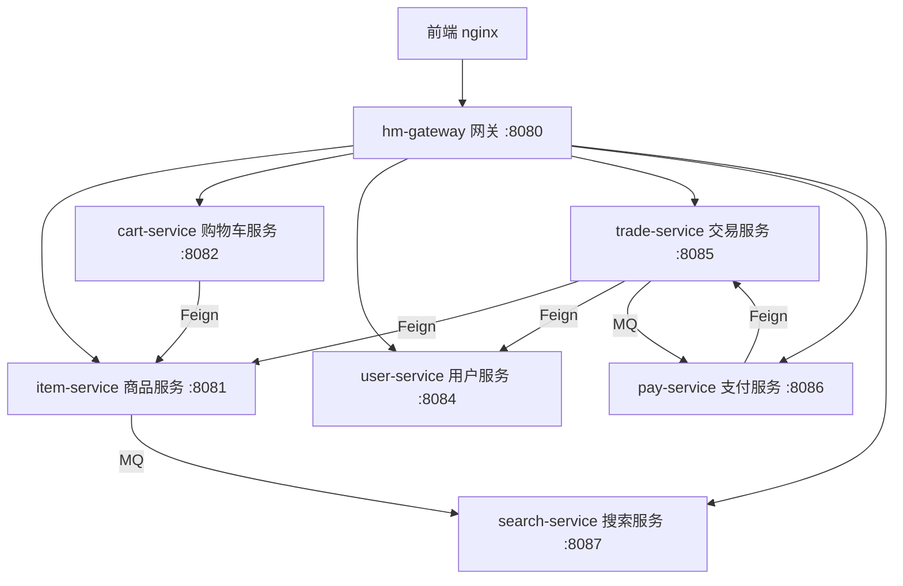

# 黑马商城（hmall）

基于 **Spring Boot 2.7 + Spring Cloud Alibaba** 的分布式电商微服务系统，覆盖商品管理、全文搜索、购物车、下单交易、余额支付、订单超时自动取消等电商核心链路，并针对分布式场景下的并发竞态、消息可靠性、分布式事务、服务雪崩等问题给出了完整的工程化解决方案。

## 项目架构



## 模块说明

| 模块 | 端口 | 说明 |
| --- | --- | --- |
| hm-gateway | 8080 | Spring Cloud Gateway 网关：JWT 统一鉴权（RSA + JKS）、Nacos 动态路由、登录态向下游透传 |
| item-service | 8081 | 商品服务：商品 CRUD、库存扣减与恢复（条件更新防超卖）、商品上下架 MQ 事件 |
| cart-service | 8082 | 购物车服务：购物车增删改查、Feign 调用商品服务、Sentinel 线程隔离 |
| user-service | 8084 | 用户服务：注册登录（BCrypt）、余额扣减/退款 |
| trade-service | 8085 | 交易服务：下单（Seata AT）、订单管理、延迟消息超时取消、支付回调处理 |
| pay-service | 8086 | 支付服务：支付单创建/关闭、余额支付、支付结果 MQ 通知 |
| search-service | 8087 | 搜索服务：Elasticsearch 商品搜索、分类/品牌聚合、MQ 驱动索引同步 |
| hm-api | - | Feign 客户端模块：各服务 Client 接口、降级 FallbackFactory、DTO |
| hm-common | - | 公共组件库：统一响应体 R、分页 PageDTO/PageQuery、全局异常处理、UserContext、RabbitMqHelper 等（spring.factories 自动装配） |
| hm-service | 8080 | 单体版应用（微服务拆分前的完整业务实现，独立运行） |

## 技术栈

| 分类 | 技术 |
| --- | --- |
| 基础框架 | Java 11、Spring Boot 2.7、Spring MVC、MyBatis-Plus 3.5.x |
| 微服务 | Spring Cloud Alibaba（Nacos、Sentinel、Seata）、Spring Cloud Gateway、OpenFeign |
| 消息中间件 | RabbitMQ（延迟消息插件、生产者确认、ACK 重试、错误队列兜底） |
| 搜索引擎 | Elasticsearch（Bool 查询、聚合分析、RestHighLevelClient 单例） |
| 数据存储 | MySQL 8.0、Redis |
| 安全认证 | JWT（RSA 非对称加密 + JKS 密钥库）、BCrypt 密码加密 |
| 工程与运维 | Maven 多模块、Docker / docker-compose、Nginx、Knife4j 接口文档 |

## 核心技术方案

1. **订单-支付竞态三层防护**：支付前校验订单状态（前置拦截）→ 取消订单时主动关闭支付单（阻断扣款）→ 支付回调发现订单已取消则自动退款（兜底），配合数据库 CAS 条件更新保证状态流转的原子性与幂等性，杜绝"钱扣了订单却被取消"的资损问题。
2. **延迟消息超时取消订单**：基于 Delayed Message Exchange 的"单次延迟 + 幂等消费"方案，消费时二次查询支付流水防止误取消。
3. **分布式用户上下文透传**：userId 在 HTTP → MQ → Feign 全链路自动透传（消息头 / 请求头 + ThreadLocal），业务代码零侵入。
4. **Feign 降级分级策略**：刚性降级（关键查询抛异常触发重试）/ 柔性降级（非核心操作记日志由补偿兜底），统一使用 fallbackFactory。
5. **MQ 可靠性建设**：封装 `RabbitMqHelper` 公共组件；生产者确认 + 持久化 + 消费端重试，失败消息 Republish 至 `{服务名}.error.queue` 兜底。
6. **ES 商品搜索与数据同步**：MQ 事件驱动索引库异步同步保证最终一致；分类 Terms 聚合嵌套品牌子聚合（size=0）动态生成过滤条件。
7. **分布式事务与防超卖**：Seata AT 模式保障"下单 → 扣库存 → 清购物车"一致性；库存扣减条件更新 `WHERE stock >= ?` 防超卖。
8. **网关与高可用**：JWT 统一鉴权、Nacos 动态路由热更新；Sentinel 线程隔离防止服务级联雪崩。

## 快速开始

### 环境要求

- JDK 11+（推荐 11 或 17）
- Maven 3.6+
- MySQL 8.0、Redis、RabbitMQ（需安装 `rabbitmq_delayed_message_exchange` 插件）、Elasticsearch（含 IK 分词器）、Nacos、Seata

### 配置说明

各服务通过 Nacos 加载配置，本地配置文件中的数据库等地址通过环境变量占位符注入：

- `hm.db.host`：MySQL 地址
- `hm.db.pw`：MySQL 密码

profile 说明：`dev` 用于 Docker 环境，`local` 用于本地开发（需按实际环境修改地址）。

### 构建与运行

```bash
# 全量构建（跳过测试）
mvn clean package -DskipTests

# 仅编译
mvn clean compile

# 运行单个测试类
mvn test -pl hm-service -Dtest=ItemServiceImplTest

# 本地启动某个服务（以 trade-service 为例，使用 local profile）
mvn spring-boot:run -pl trade-service -Dspring-boot.run.profiles=local
```

建议启动顺序：Nacos / Seata / 中间件 → hm-gateway → user-service、item-service → cart-service、trade-service、pay-service、search-service。

### 接口文档

各服务启动后访问 Knife4j 文档：`http://localhost:{port}/doc.html`

## 项目结构

```
hmall
├── hm-gateway          # 网关服务
├── item-service        # 商品服务
├── cart-service        # 购物车服务
├── user-service        # 用户服务
├── trade-service       # 交易服务
├── pay-service         # 支付服务
├── search-service      # 搜索服务
├── hm-api              # Feign 客户端与 DTO
├── hm-common           # 公共组件库（自动装配）
├── hm-service          # 单体版应用
└── pom.xml             # 父 POM（统一依赖版本管理）
```
